# Sales Agent AI

## Overview

Sales Agent Integration introduces a cutting-edge solution for business owners to discover potential leads with ease. By specifying their business type and target audience through a simple chat with a sales agent, users receive a curated list of relevant leads in an organized format. This streamlined process enhances customer outreach and supports business growth.

## Key Features

- **Chat-Based Input**: Business owners can provide their business type and target audience through a friendly chat interface with the sales agent on the telex platform.
- **Curated Lead Generation**: The sales agent retrieves a list of potential leads tailored to the specified criteria.
- **Organized Output**: Leads are presented in a clear and easy-to-read format.
- **Custom Automation**: The lead retrieval process runs automatically at a set time, ensuring business owners always have access to updated leads.
- **Telex Success Notifications**: Users receive success messages via the Telex channel whenever new leads are fetched.

## How It Works
### Telex Setup and activating the Sales Agent
#### Steps
1. **Sign Up**: Sign up for a Telex account at [Telex](https://telex.im).
2. **Create an Organisation**: Create an organisation on the Telex platform.
   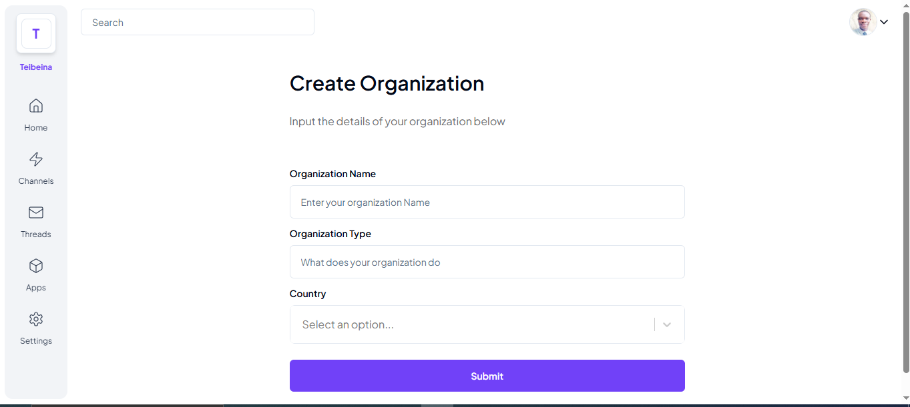
3. **Create a Channel**: Create a channel in the organisation.
   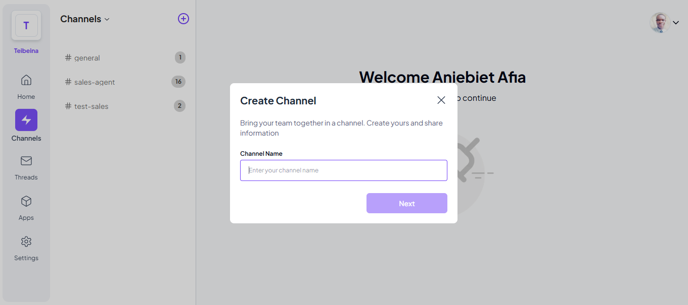
4. **Add the Sales Agent**: Click on `Apps`, then click on `Add New` to add the Sales Agent to the channel.
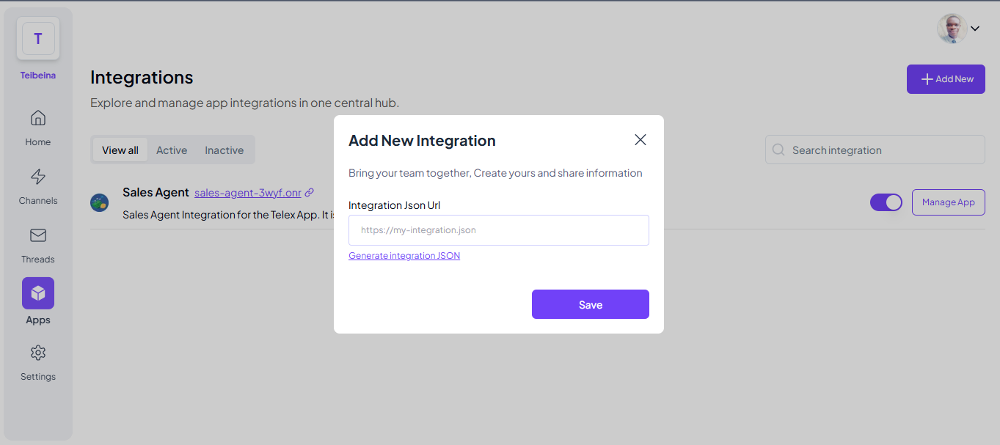
5. **Sales Agent Integration**: Enter this URL `https://sales-agent-3wyf.onrender.com/integration.json` in the `Integration Json Url` field and click `Save`.
6. **Activate the Sales Agent**: Click on `the toggle button` to activate the Sales Agent in the channel.
7. **Confugure the Sales Agent**: Click on the `Manage App` button to configure the Sales Agent.
8. **Set the Custom Channel**: Click on the `Output` tab -> Custom Channels -> Add Custom Channel -> Select the channel you want to see the output.
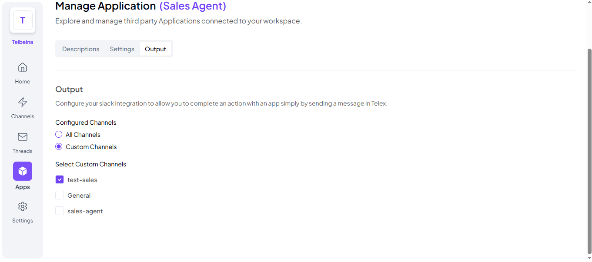
9. You're all set! The Sales Agent is now active in the channel.

### Sales Agent Chat Interaction

The chat interaction between business owners and the sales agent takes place in the telex channel and is handled by the `ChatService` class  which processes messages, validates inputs, and guides users through a structured flow to collect information for lead generation. Below is a breakdown of the interaction steps:

#### Interaction Flow

1. **Starting the Process**:
    - Users begin the process by sending the `/start` command.
    - The system responds with a welcome message and prompts users to provide their business email address.

       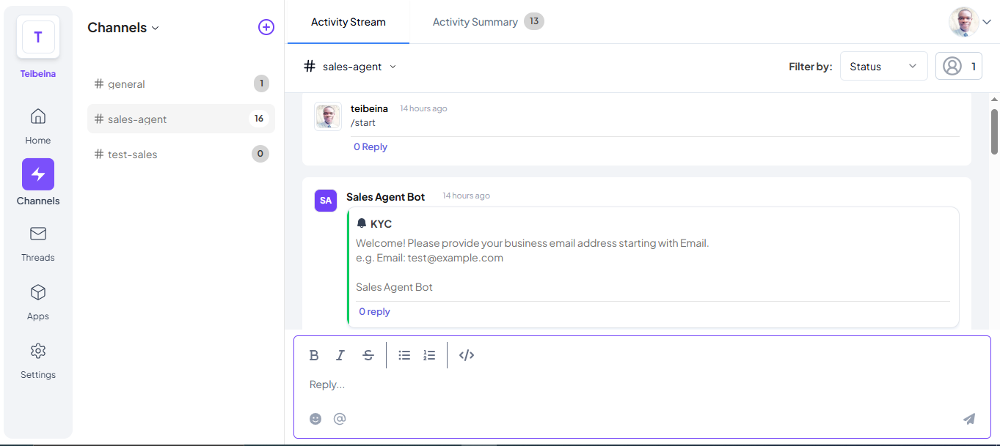

2. **Exiting the Process**:
    - At any point during the interaction, users can exit the process by sending the `/exit` command.
    - The system acknowledges the exit request and stops the interaction.

       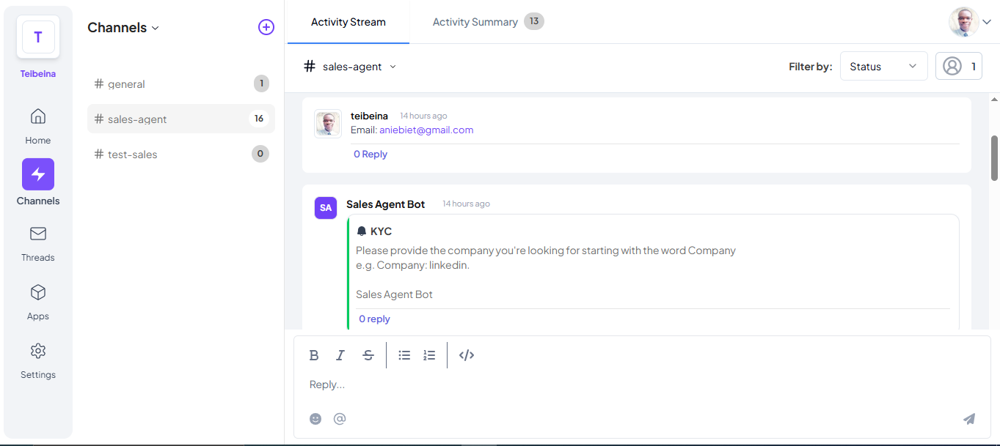

3. **Email Validation**:
    - The system validates the provided email address using a regex pattern.
      
    - If the email is invalid or already exists in the system, an appropriate message is displayed.
   
      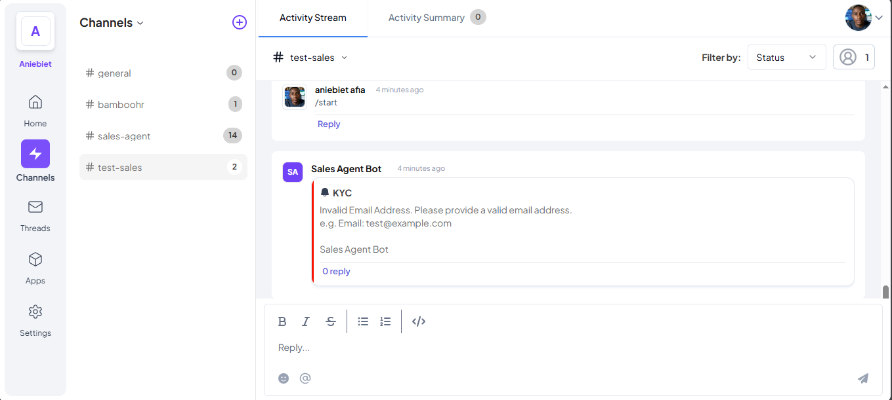
4. **Company Information**:
    - Users are prompted to specify the company they are targeting by starting their response with `Company:` (e.g., `Company: linkedin`).
    - Input is validated to ensure it follows the required format.

      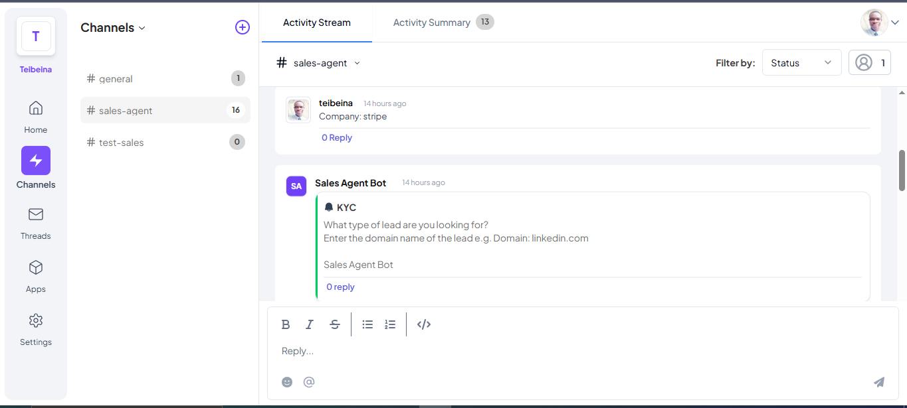

5. **Lead Type**:
    - Users specify the type of lead they need by providing the lead's domain name (e.g., `linkedin.com`).

      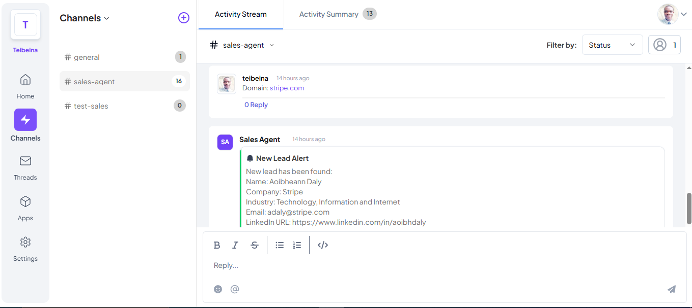

6. **Automated Instructions**:
    - Clear and friendly instructions are sent at every step of the process.
    - The system communicates with users via the configured Telex webhook URL.

7. **Persisting User Data**:
    - Once all required inputs are collected, the user's information (email, company name, and lead type) is saved in the database for further processing.

   
8. **Domain Search Integration**:
    - The service triggers the `domain-search` endpoint of the lead generation API to fetch leads matching the specified criteria.

9. **Success Notification**: 
    - Upon successful lead retrieval, the system sends a notification to the user via the Telex channel with all the leads found.

      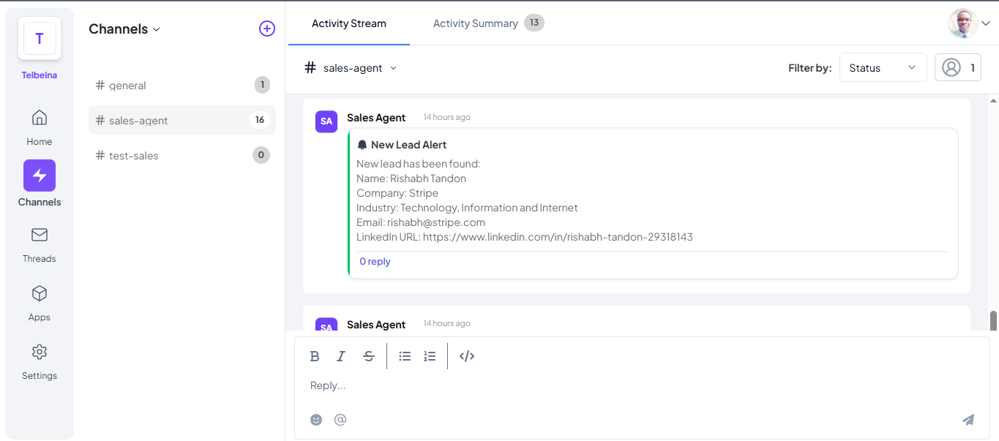
      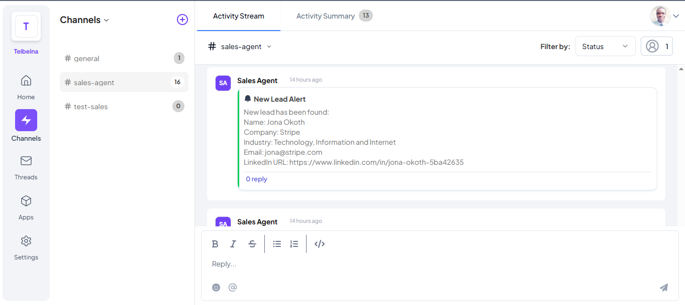
      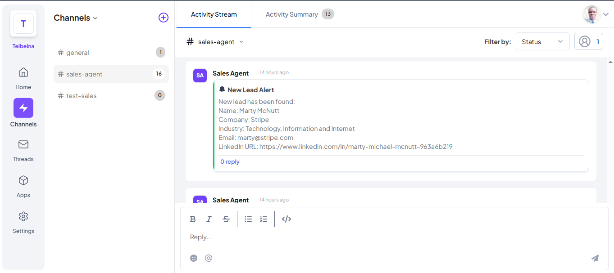
   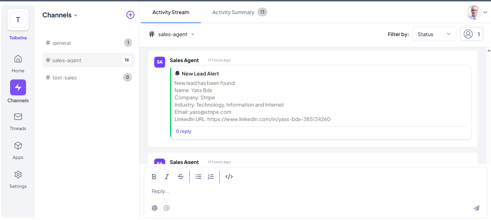
      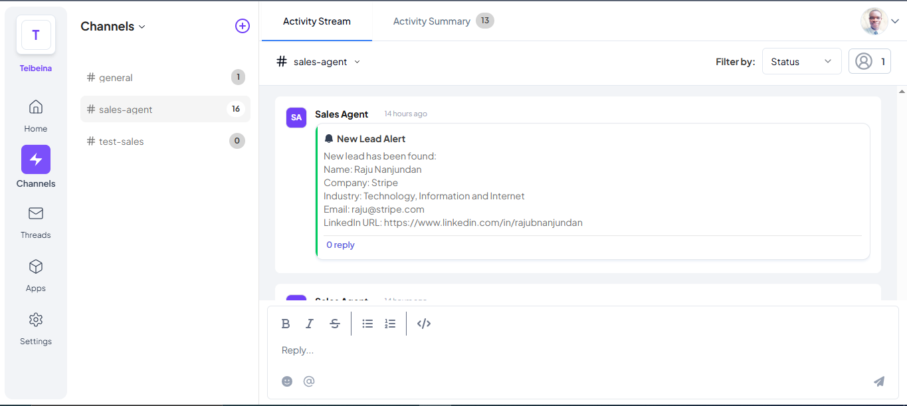
      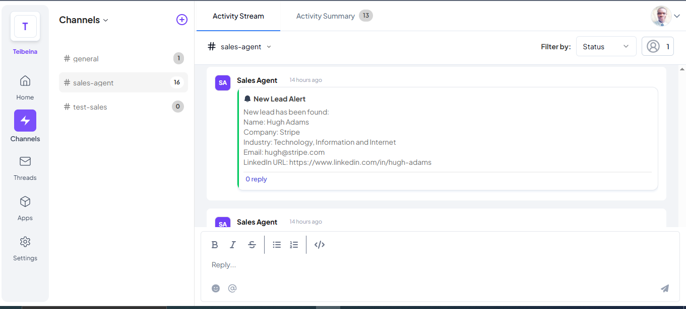

### Lead Search Integration

The lead search feature is implemented in the `domainSearch` method of the `LeadService` class. It retrieves potential leads based on the user's specified domain and stores new, unique leads in the database. Below is an overview of its workflow:

#### Workflow

1. **Retrieve User Details**:
   - The `domainSearch` method starts by fetching the user's information from the database using the `channel_id` from the `SalesAgentPayloadDTO` payload.
   - If the user is not found, an exception is thrown.

2. **Construct API Request**:
   - The method uses the domain provided by the user (`LeadType`) to construct the `domain-search` API request.
   - The API key and base URL for the request are configured in `OkHttpConfig`.

3. **Fetch and Parse Data**:
   - A `GET` request is sent to the Hunter.io API
   - The API response is parsed into a JSON object to extract relevant data, such as email addresses, names, LinkedIn URLs, company information, and industry.

4. **Filter Unique Leads**:
   - Existing leads in the database are checked to ensure no duplicates are stored.
   - New leads are created only for entries with unique email addresses.

5. **Save Leads and Notify**:
   - New leads are saved to the database.
   - For each new lead, the system sends a notification to the specified `Telex channel` using the `TelexClient`.

6. **Log Success**:
   - Logs are generated to confirm how many new leads were successfully saved.
